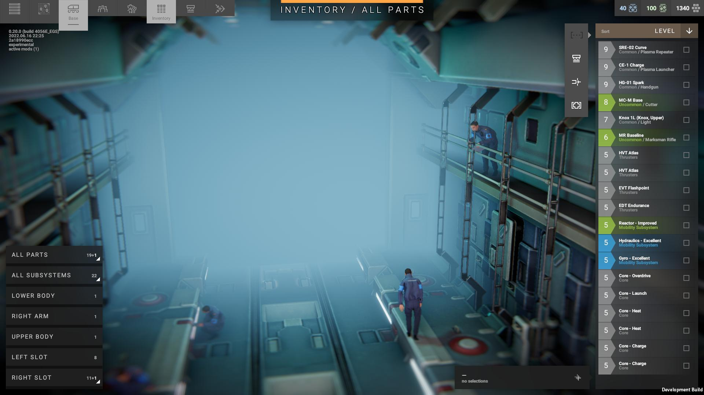

**InventoryFilter**
----
A library mod for [Phantom Brigade (Alpha)](https://braceyourselfgames.com/phantom-brigade/) that brings over the concept of filtering by categories from the mobile base workshop screen to the mobile base inventory screen.

It is compatible with game version **0.20.0**. All library mods are fragile and susceptible to breakage whenever a new version is released.

**!!! Warning !!!** This mod is not finished and should not be installed. Right now it is more of a proof of concept for customizing the mobile base UI. Other mod makers may find it of interest as an example of where to hook into the mobile base screens.

**Status**
----
UI layout is mostly done. There's some jank when switching screens because I don't fully understand the UIHideable animation system.

UI event handling is still in progress. The inventory item list is used in a lot of places throughout the game and I didn't realize how hairy it is until I got fairly deep into this. I'm treading lightly so as to not break anything outside the mobile base inventory screen.

I plan on adding a right click handler to the category buttons to bring up the old item filtering list. The idea is to have coarse top-level filtering and then a second, finer level of filtering within a category.

I've stalled out on the logic because of a hard separation between parts (weapons, body parts) and subsystems (thrusters, capacitors, reacters). I'm doing a lot of refactoring of the existing code to get the two categories to play nice together in a single list. That's a good indication it's time to step back and reconsider what I'm doing.

**Screenshot**
----
Here's a screenshot for those curious about the UI layout. I removed the filter button at the top of the item list and replaced it with a vertical category list similar to what's on the workshop screen. The item list supports showing parts like weapons mixed with subsystems like cores.

I also put the resource counters in the upper right, same as the workshop and upgrades screens. I use this when I need to get some extra supplies (for a base upgrade or workshop project) by salvaging extra items in my inventory and this let's me check how much closer I am to what I need with every part I scrap.

